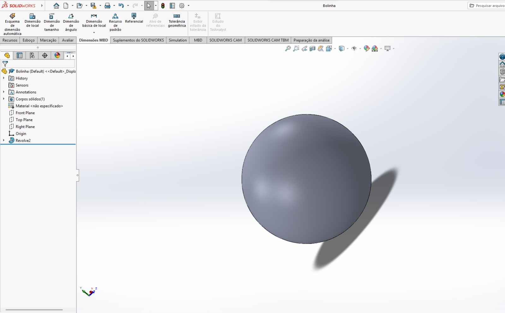

# 🧩 3D Printing Project — SolidWorks Modeling & Assembly

This project contains 3D models and assemblies created in **SolidWorks** as part of a practical engineering activity involving CAD modeling and preparation for **3D printing**.

The parts were modeled individually, adjusted for print tolerances, and then assembled to verify fitment and mechanical behavior.

---

## 🛠️ Project Scope

- 3D modeling of individual components  
- Creation of final assembly to validate dimensions  
- Adjustment for 3D printer tolerances  
- Export for slicing and printing  
- Fit-test performed after printing  
- Iterations of improved versions (ex: *Presilha 2.0, 3.0, 3.5*)  

---

## 📁 Files Included

### **Parts (.SLDPRT)**  
- Meia-Peça.SLDPRT  
- Part1.SLDPRT  
- Conector2.SLDPRT  
- Presilha.SLDPRT  
- Presilha-2.0.SLDPRT  
- Presilha-3.0.SLDPRT  
- Presilha-3.5.SLDPRT  

### **Assembly (.SLDASM)**  
- Assem1.SLDASM  

### *(Optional)* STL / OBJ files can be added later for direct 3D printing.

---

## 🧰 Tools & Technologies

- **SolidWorks** — CAD design, modeling, and assembly  
- **3D Printing (FDM)** — final manufacturing process  
- **Design for Additive Manufacturing (DFAM)** principles  
- Tolerance adjustments  
- Measurement and fitment testing  

---

## 🧪 Process Summary

1. Modeling individual components based on measurements  
2. Creating assembly to test fit and interactions  
3. Adjusting dimensions for print tolerances  
4. Exporting the final model to STL  
5. 3D printing test versions  
6. Improving the design (iterations 2.0, 3.0, 3.5)  

---

## 🖼️ Project Images

### **1️⃣ Real life Orbit Ball**

  

### **2️⃣ SolidWorks Modeling — Orbit Component**

  

### **3️⃣ Split/Meia-Peça View**

  

### **4️⃣ Detail Component — Bolinhas (Connector Detail)**

  

---

## 🔧 Presilha (Clip) Versions — Iterative Design

### **Version 1.0**

  

### **Version 2.0**

  

### **Version 3.0**

  

---

## 📌 Notes

## 📌 Notes

This project was developed as part of a **group assignment** focused on creating and improving a **toy designed for children with special needs**.  
The work involved collaborative CAD modeling, iterative design, mechanical adjustments, and preparation for 3D printing to ensure safety, usability, and accessibility.

More design iterations and improvements may be added as the project evolves.

---

📬 **Contact:**  
GitHub: https://github.com/rosa-carolina  
LinkedIn: https://www.linkedin.com/in/carolina-resende-rosa-b26909252
